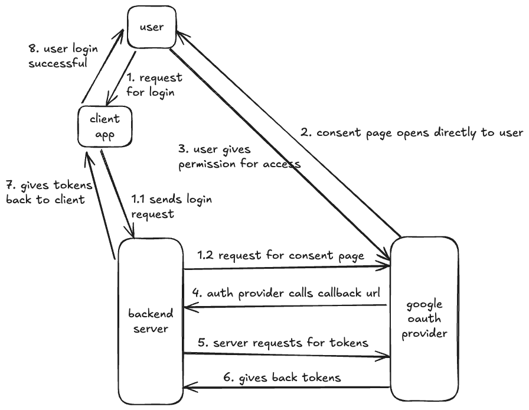

## Google OAuth 2.0 Flow in Golang and React.js

Test the app here: https://oauth.arcade.build

Read the blog for implementation details [Google OAuth 2.0 Flow in Golang and React.js](https://dev.to/the-arcade-01/google-oauth-20-flow-in-golang-and-reactjs-536a)

### Run this project

1. Get your Client ID and secret keys from google cloud https://console.cloud.google.com/auth/clients
2. Create `.env` file and update the env variables from `.env.example` file
   - for local run
     ```shell
     HTTP_COOKIE_HTTPONLY=false
     HTTP_COOKIE_SECURE=false
     ```
3. Use docker for running the app, all the services are listed in `docker-compose.yml`

```shell
~> docker compose build
~> docker compose up
```

### Architecture

- OAuth Flow

1. User requests for login from the client app
2. The client app hits login endpoint on the backend
3. The backend server generates the unqiue url of auth provider consent page and redirects the request
4. The consent page opens directly to the user requesting for granting permission
5. The user gives access to the permission, then auth provider calls the callback url of the backend server
6. The backend server then generates the access and refresh tokens and sets them in http only cookies
7. The backend server then redirects to the success page of the client app



- Access & Refresh token Flow

1. Backend sets access and refresh token to http only cookie
2. Client calls protected routes using the access token
3. If the access token expires, the client then calls `/refresh-token` API using the refresh token from cookies
4. Backend then issues new access token and sets it in the cookie


### Tech

1. Golang
2. React.js
3. MySQL
4. Docker
5. Google OAuth
