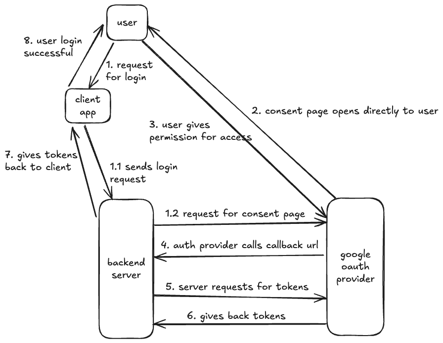
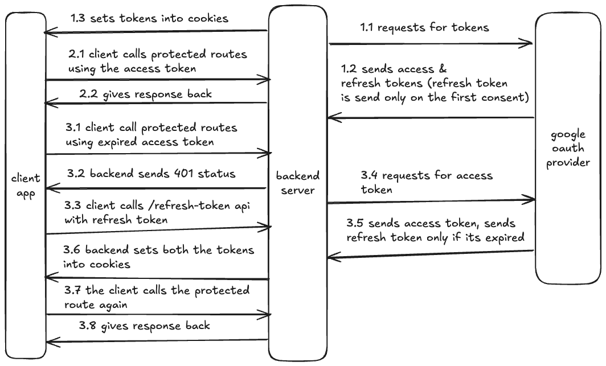

## Google OAuth 2.0 Flow in Golang and React.js

In this blog I've shared my approach on integrating Google OAuth in my app (Golang for backend and React.js for frontend).

The code for this https://github.com/the-arcade-01/react-golang-oauth-flow

You can test the app itself here: https://oauth.arcade.build

### Architecture

- OAuth Flow

1. User requests for login from the client app
2. The client app hits login endpoint on the backend
3. The backend server generates the unqiue url of auth provider consent page and redirects the request
4. The consent page opens directly to the user requesting for granting permission
5. The user gives access to the permission, then auth provider calls the callback url of the backend server
6. The backend server then generates the access and refresh tokens and sets them in http only cookies
7. The backend server then redirects to the success page of the client app



- Access & Refresh token Flow

1. Backend sets access and refresh token to http only cookie
2. Client calls protected routes using the access token
3. If the access token expires, the client then calls `/refresh-token` API using the refresh token from cookies
4. Backend then issues new access token and sets it in the cookie



### Code overview

Here I won't put all the code from repo, I will just explain few code snippets so that you can implement it in your own way.

- Backend

1. First, we need to create the oauth client with which we will interact with google auth <br>
   You can get the client ID and secret from here https://console.cloud.google.com/auth/clients

```go
func newOauthConfig() *oauth2.Config {
	return &oauth2.Config{
		ClientID:     Envs.GOOGLE_CLIENT_ID,
		ClientSecret: Envs.GOOGLE_CLIENT_SECRET,
		RedirectURL:  Envs.AUTH_REDIRECT_URL, // http://localhost:8080/api/auth/callback
		Scopes:       []string{"https://www.googleapis.com/auth/userinfo.profile", "https://www.googleapis.com/auth/userinfo.email"},
		Endpoint:     google.Endpoint,
	}
}
```

2. Calling the auth provider for consent page

```go
	url := h.config.OauthCfg.AuthCodeURL(state, oauth2.AccessTypeOffline) // AccessTypeOffline issues both access & refresh token
	http.Redirect(w, r, url, http.StatusTemporaryRedirect)
```

3. Handling callback function from auth provider

```go
func (h *AuthHandlers) Callback(w http.ResponseWriter, r *http.Request) {
	code := r.URL.Query().Get("code")
	token, err := h.config.OauthCfg.Exchange(r.Context(), code)
	if err != nil {
		http.Redirect(w, r, fmt.Sprintf("%s=%s", config.Envs.APP_WEB_URL_LOGIN_ERROR, "exchange_failed"), http.StatusTemporaryRedirect)
		return
	}

	client := h.config.OauthCfg.Client(r.Context(), token)
	res, err := client.Get(config.Envs.GOOGLE_USER_INFO)
	if err != nil {
		http.Redirect(w, r, fmt.Sprintf("%s=%s", config.Envs.APP_WEB_URL_LOGIN_ERROR, "userinfo_failed"), http.StatusTemporaryRedirect)
		return
	}
	defer res.Body.Close()

	var userInfo map[string]string
	json.NewDecoder(res.Body).Decode(&userInfo)

	_, errResult := h.svc.Login(r.Context(), userInfo)
	if errResult != nil {
		http.Redirect(w, r, fmt.Sprintf("%s=%s", config.Envs.APP_WEB_URL_LOGIN_ERROR, "login_failed"), http.StatusTemporaryRedirect)
		return
	}

	h.setCookies(w, token)
	http.Redirect(w, r, config.Envs.APP_WEB_URL_LOGIN_SUCCESS, http.StatusTemporaryRedirect)
}
```

4. Setting the tokens in cookie

```go
func (h *AuthHandlers) setCookies(w http.ResponseWriter, token *oauth2.Token) {
	http.SetCookie(w, &http.Cookie{
		Name:     "access_token",
		Value:    token.AccessToken,
		Expires:  token.Expiry,
		HttpOnly: config.Envs.HTTP_COOKIE_HTTPONLY, // true for production, false for local
		Secure:   config.Envs.HTTP_COOKIE_SECURE, // true for production, false for local
		SameSite: http.SameSiteLaxMode,
	})

	// NOTE: Refresh token is only issued at the first consent
	if token.RefreshToken != "" {
		http.SetCookie(w, &http.Cookie{
			Name:     "refresh_token",
			Value:    token.RefreshToken,
			Expires:  time.Now().Add(time.Duration(config.Envs.HTTP_REFRESH_TOKEN_EXPIRE) * time.Hour),
			HttpOnly: config.Envs.HTTP_COOKIE_HTTPONLY,
			Secure:   config.Envs.HTTP_COOKIE_SECURE,
			SameSite: http.SameSiteLaxMode,
		})
	}
}
```

5. To get the refresh token

```go
// refreshToken is extracted from cookies
	tokenSource := h.config.OauthCfg.TokenSource(r.Context(), &oauth2.Token{
		RefreshToken: refreshToken.Value,
	})
	newToken, err := tokenSource.Token()
```

- Frontend

1. Creating request interceptors using axios, interceptors are functions which are triggered before an api request or on its response or both.<br>
   Here on the response, we are checking if its 401 then we need to refresh the access token again.<br>
   We will use this api client for calling our apis.

```ts
const api = axios.create({
  baseURL: env.VITE_API_URL,
  withCredentials: true,
});

api.interceptors.request.use(
  (config) => {
    return config;
  },
  (error) => {
    return Promise.reject(error);
  }
);

api.interceptors.response.use(
  (response) => {
    return response;
  },
  async (error) => {
    const originalRequest = error.config;
    if (error.response.status === 401 && !originalRequest._retry) {
      originalRequest._retry = true;
      try {
        const res = await axios.post(
          `${env.VITE_API_URL}/auth/refresh-token`,
          {},
          { withCredentials: true }
        );
        if (res.status === 200) {
          return api(originalRequest);
        }
      } catch (refreshError) {
        return Promise.reject(refreshError);
      }
    }
    return Promise.reject(error);
  }
);
```

2. Creating a AuthProvider context

```ts
interface AuthContextType {
  isAuthenticated: boolean;
  user: User | null;
  login: () => void;
  logout: () => Promise<void>;
}

const AuthContext = createContext<AuthContextType | undefined>(undefined);

export const AuthProvider = ({ children }: { children: ReactNode }) => {
  const [isAuthenticated, setIsAuthenticated] = useState(false);
  const [user, setUser] = useState<User | null>(null);
  const [loading, setLoading] = useState(true);

  const checkAuthStatus = async () => {
    try {
      const response = await api.get("/auth/user/me");
      setUser(response.data.data);
      setIsAuthenticated(true);
    } catch (error) {
      setIsAuthenticated(false);
      setUser(null);
    } finally {
      setLoading(false);
    }
  };

  useEffect(() => {
    checkAuthStatus();
  }, []);

  const login = () => {
    window.location.href = `${env.VITE_API_URL}/auth/login`;
  };

  const logout = async () => {
    await api.post("/auth/logout");
    setIsAuthenticated(false);
    setUser(null);
  };

  if (loading) {
    return <LoadingSpinner />;
  }

  return (
    <AuthContext.Provider value={{ isAuthenticated, user, login, logout }}>
      {children}
    </AuthContext.Provider>
  );
};

export const useAuth = () => {
  const ctx = useContext(AuthContext);
  if (ctx === undefined) {
    throw new Error("useAuth must be used within AuthProvider");
  }
  return ctx;
};
```

3. Protected Route component, using the context isAuthenticated bool to check user auth

```ts
const ProtectedRoute = ({ children }: ProtectedRouteProps) => {
  const { isAuthenticated } = useAuth();

  if (!isAuthenticated) {
    return <Navigate to="/login" replace />;
  }

  return children;
};
```

In App.tsx, making Profile page as protected route

```ts
<Route
  path="/profile"
  element={
    <ProtectedRoute>
      <Profile />
    </ProtectedRoute>
  }
/>
```

### Future Improvements

1. Storing the refresh token in DB
   - Since the refresh token is only returned on the first consent, its ideal to store it in DB as if it gets lost on the client app we can set it again after fetching it from the DB.
   - Second, if in case we need to revoke the refresh token, we can delete it from DB, and revoke it from auth provider and then issue it again from login flow
   - The refresh token has to be send on each login request (whether fetching it from DB if its not expired, or generating new one if its expired)

### References:

Some more learning resources which you can refer

1. https://www.youtube.com/watch?v=xNGY3wGiGAg
2. https://datatracker.ietf.org/doc/html/rfc6749#section-1.5
3. https://www.youtube.com/watch?v=fyTxwIa-1U0
4. https://www.youtube.com/watch?v=AcYF18oGn6Y&t=957s
